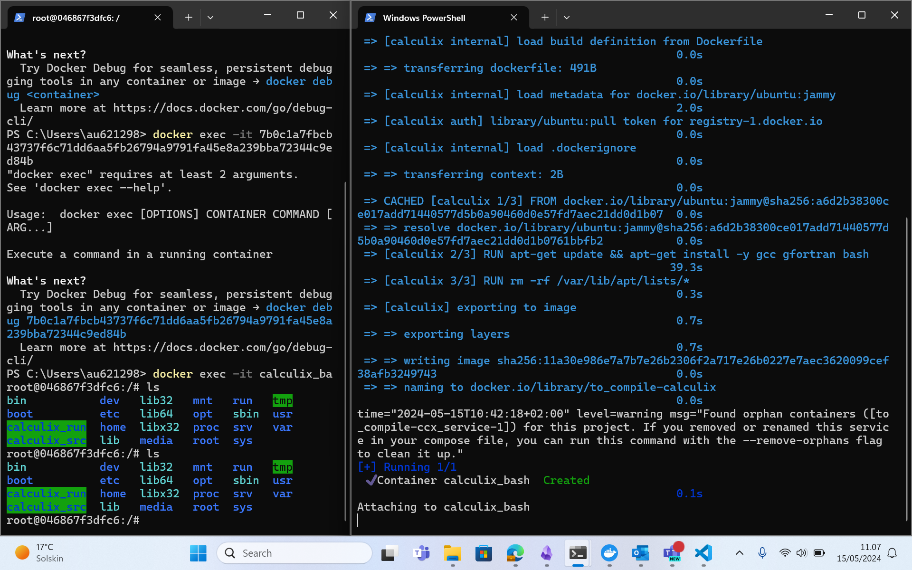

Procedure to compile CalculiX 2.21:
* open a powershell and type `docker-compose up --build -d` to instantiate the container.
* to close the container typ `docker-compose down`
* open another powershell and type `docker exec -it calculix_bash /bin/bash` to access the bash of the container.
* install calculix by executing the installation script `./install_calculix.sh` and then commit the new image with the compiled code.
* to run the VNC server execute the script `./startup.sh` and then connect from the host PC using UltraVNC at localhost:5901.
* if you edit the make files in MS Windows be reminded to fix the end of line characters for linux by typing `sed -i 's/\r$//' /path/to/your/script.pl` for all edited files. You can also fix the EOL character from Notepad++ (Edit->EOL conversion->Unix)
* once all software in the container is installed you can commit the image to a customized image by typing `docker commit 3a8d6f2c1f1e calculix_ready2go` where `3a8d6f2c1f1e` is an example of container ID, which you can retrive by typing `docker ps -a`, which lists all containers including the stopped ones.

 *Screenshot of the Powershells*